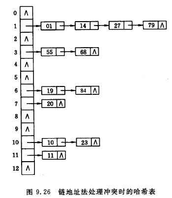

# 哈希表

## 哈希函数构造方法
1. 直接定址法 
    > 取关键字或关键字的某个线性函数作为哈希地址，

    $$hash(key) = key\ or\ hash(key)=a*hash + b$$
2. 数字分析法
    > 假设关键字是以r为基的数，并且哈希表中可能出现的关键字是已知的，则可取关键字中的若干位作为哈希地址
3. 平方取中发
    > 取关键字平方后的中间几位作为哈希地址
4. 折叠法
    > 将关键字分割成位数相同的几部分，然后取这几部分的叠加和作为哈希地址。
5. 除留余数法
    > 取关键字被某个不大于哈希表表长m的数p除后所得余数作为哈希地址。一般情况下，可以选p为质数或者不包含小于20的质因数的合数。

    $$hash(key) = key\ mod\ p, p<=m$$

6. 随机数法
    > 选择一个随机数，去关键字的随机函数值作为它的哈希地址 
    
    $$hash(key) = random(key)$$

## 处理冲突的方法

1. 开放定址法

    $$hash_i = (hash(key) + d_i)\ mod\ m\ i=1,2,...,k(k<=m-1)$$
    >hash(key)为哈希函数，m为哈希表长，$d_i$为增量序列
2. 再哈希法

    $$hash_i = hash_i(key)\ i=1,2,...k$$
    > 产生冲突时，使用另个个哈希函数计算哈希地址，直到不再冲突。
3. 链地址法
    > 将所有关键字的同义词的记录存储在同一线性链表中。

    
4. 建立公共溢出区
