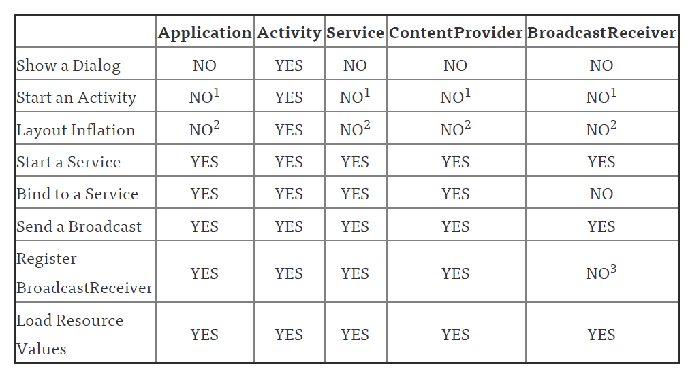

# Activity的生命周期和启动模式
## Activity的生命周期


### 正常状态下生命周期分析
> 正常情况下，旧Activity的onPause先调用，然后新Activity才启动

### 异常情况下生命周期分析
1. 当系统配置发生改变

    当系统配置发生改变，Activity会被销毁，其onPause，onStop，onDestroy均会被调用，同事由于Activity是在异常情况下终止的，系统会调用onSaveInstanceState来保存当前Activity的状态。当Activity被重新创建后，系统会调用onRestoreInstanceState。

2. 内存资源不足导致低优先级的Activity被杀死
    数据存储和回复过程跟1)是一样的


# Activity的4种launch mode
## standard 
> 每次都会新创建一个Activity的实例，放到栈顶
## singleTop
> A-B-C-D，当D在顶部时，D收到Intent，并不会产生一个新的D的实例，而是会调用D的onNewIntent方法。但是即使B是singleTop，B收到一个Intent，也会重新创建一个B的实例

应用：防止快速点击，产生多个实例

3. singleTask
> 系统会创建一个新的Task，并且把Activity放在Task的栈底，如果Activity已经存在于其他的Task中，那么系统会调用该Activity实例的onNewIntent方法。

应用：设置在MainActivity，用户重新登录后，通过SingleTask和ClearTask启动标记可以返回到MainActivity

4. singleInstance
> 跟singleTask一样，不同的是Activity只会是一个单例，并且独占一个Task

应用： Home Screen

## 结束所有Activity
对API 16+
> finishAffinity();
对低于API 16
> ActivityCompat.finishAffinity(YourActivity.this);

# Handler
> This Handler class should be static or leaks might occur: IncomingHandler

Handle的实现类应该为静态，因为同一个Thread的所有handler都共用一个Looper,而每一个Message都持有Handler的引用，handler又持有Activity的引用，因此如果Message还在多列中，那么Activity就不能为GC回收。
可看[Stackoverflow的解释](https://stackoverflow.com/questions/11407943/this-handler-class-should-be-static-or-leaks-might-occur-incominghandler)。

Handler机制：首先对于每一个线程都有一个Looper，Looper.prepare()方法向其内部的ThreadLocalc存放一个新的Looper，每个线程只能执行一次。每个Looper内部有一个MessageQueue，handler发消息时，发到Looper内部的MessageQueue。Looper.loop()方法会循环从队列中获取Message，取到Message后，在调用handler的handleMessage方法。

相关参考
> [Android中为什么主线程不会因为Looper.loop()里的死循环卡死](https://www.zhihu.com/question/34652589)

# 多线程的方式
1. new Thread()
2. AsyncTask
    > 内部封装了Handler和线程池
3. HandlerThread
    > 继承了Thread，内部封装了Handler，在run方法中开启Looper.使用时自定义一个Handler，将HandlerThread的Looper作为参数。
4. IntentService
    > 内部封装了HandlerThread
5. ThreadPoolExecutor
    - FixedThreadPool
        > 线程数量固定
    - CachedThreadPool
        > 线程数量可以动态增加
    - ScheduledThreadPool
    - SingleThreadExecutor


# [ANR](https://developer.android.com/topic/performance/vitals/anr)

> Applicatoin Not Responding。ANR产生的原因是负责更新UI的线程，不能继续处理用户输入或者更新UI

### 产生原因
1. 5s内没有响应用户输入事件
2. 10s内广播接收器没有处理完毕

### 诊断方法
1. 在main线程内进形I/O操作
2. 在main线程进行耗时的运算
3. 同步binderd到另一个进程，该进程进行耗时操作

## Strict Mode
在Application中配置StrictMode

## traces.txt

> adb pull /data/anr/traces.txt

# GC

## 回收算法

- 引用计数法

- Tracing算法或标记-清除算法
    - 根搜索算法
    - Tracing算法
    - 标记清除算法
- 标记-整理算法
- Copying算法（复制算法）
- 分代算法 （Generation）

# View

[浅谈DecorView与ViewRootImpl](https://www.jianshu.com/p/687010ccad66)

## View的三大流程

Activity的setContentView会调用Window的setContentView，PhoneWindow是Window的实现类，PhoneWindow的setContentView会new一个DecorView，DecorView包含了标题部分和内容部分，内容部分的id为android.R.id.content,Activity的布局被添加到content内。

### measure过程
ViewRootImpl的performTraversals()方法会依次调用performMeasure,performLayout()和performDraw()三个方法，完成measure，layout，draw三大流程。

ViewRootImpl的performMeasure()调用DecorView的measure()方法。
DecorView是一个ViewGroup。
View的measure()调用 onMeasure()。对于一个ViewGroup，它的onMeasure()方法会遍历所有子View，然后依次调用子View的measure方法，完成测量过程。


### layout过程
View的layout方法会调用onLayout方法，对于ViewGroup，onLayout方法会遍历所有子View，依次调用子view的layout方法，完成layout过程。

ViewRootImpl的performLayout会调用DocorView的layout方法，完成测量过程。

### draw过程

View的draw方法先调用自身的onDraw方法，完成自身的绘画。如果是ViewGroup，会在dispatchDraw方法中遍历所有子View，依次调用子View的draw方法，完成绘画过程。

## View的基础知识

### View的位置参数

View的left,top 是相对于父容器的左上角的横、纵坐标，right，bottom是右下角的横、纵坐标。translationX和translationY是View的左上角相对于父容器的偏移值。

MotionEvent的getX/Y是相对于View左上角的x,y坐标，getRawX/Y是相对于手机屏幕左上角的x,y坐标。

通过VelocityTracker可以计算滑动的速度。

GestureDetector检测手势。

###
自定义View
- 重写onMeasure设置wrap_content时的宽高
- 重写onSizeChanged获取最终宽高
- 重写onDraw方法画自定义的内容

### View的滑动
- scrollTo/scrollBy只是滑动内容，对ViewGroup有效。
- setTranslationX/Y，对所有View都有效
- 动画 
- 改变布局参数 


## view点击事件传递

事件传递方向 Actiivty->PhoneWindow->DecorView->layout

ViewGroup的dispatchTouchEvent方法中，先判断onInterceptTouchEvent是否要拦截点击事件，不拦截的话就遍历子View，调用子View的dispatchTouchEvent。


# View动画
## Android动画分类
- View动画
    - 平移  TrnaslateAnimation
    - 旋转  RotateAnimation
    - 缩放  ScaleAnimation
    - 透明度 AlphaAnimation
- 帧动画
    > 逐帧播放图片。通过xml的\<animation-list>标签
- 属性动画
    > 动态改变对象属性实现动画


# Dalvik和ART区别

- Dalvik
    > Dalvik支持JIT(Just in time)技术，每次启动都要讲字节码编译为dex。第一次加载会生成缓存。
- ART 
    > ART，即Android Runtime，使用AOT（Ahead of time)，在应用安装的时候将字节码编译为dex，机器码。

# Bitmap高效加载

BitmapFactory类提供了4类方法加载图片

- decodeFile        从文件系统加载Bitmap对象
- decodeResource    从资源加载Bitmap对象
- decodeStream      从输入流加载Bitmap对象
- decodeByteArray   从字节数组加载Bitmap对象

通过BitmapFactory.Option的inSampleSize缩放图片，避免OOM


# LruCache源码分析
内部维护了一个LinkeHashMap存储缓存,LinkedHashMap的accessOrder设置为true，所以LinkedHashMap的元素依据访问顺序排序。
LruCache的get方法，获取key对应的缓存value，如果value不存在，调用create方法创建value，并且把value插入到map中。
LruCache的put方法，插入一堆key和value。
get和put方法之后都会调用trimMaxSize，将排在最后且超过容器最大size的元素移除。

# DiskLruCache
可以看到DiskLruCache，利用一个journal文件，保证了保证了cache实体的可用性（只有CLEAN的可用），且获取文件的长度的时候可以通过在该文件的记录中读取。利用FaultHidingOutputStream对FileOutPutStream很好的对写入文件过程中是否发生错误进行捕获，而不是让用户手动去调用出错后的处理方法。其内部的很多细节都很值得推敲。


# IPC机制

## IPC简介 
IPC是 Inter-Process Communication的缩写，含义为进程间通信或跨进程通信，是指两个进程之间进行数据交换的过程。

## Android中的多进程模式

### 开启多进程模式
- 在AndroidManifest中指定android:process
- 通过JNI的native层fork一个新的进程

### 多进程的运行机制
Android为每一个应用/每一个进程分配一个独立的虚拟机。

多进程会有以下几个问题：
- 静态成员和单例模式失效
- 线程同步机制完全失效
- SharedPreferences的可靠性下降
- Application会多次创建


## IPC基础概念

### 序列化方式
- 实现Serializable接口
- 实现Parcelable接口

## Android的IPC方式

跨进程通信方式：
- Intent附加extras来传递信息
- 在SD卡共享文件方式来共享数据
- 采用Binder方式跨进程通信
- 使用Messenger方式
- ContentProvider天生支持跨进程访问
- 采用Socket
- 广播
- 使用AIDL


# 四大组件的工作过程
## 四大组件
- Activity
- BroadcastReceiver
- Service
- ContentProvider

## Activity的工作过程

启动Activity
``` Java
Intent intent = new Intent(this,TargetActivity.class);
startActivity(intent);
```

# 面试题集合

## 谈谈对Context的理解
Context是包含应用环境的全局信息的接口，它的实现类由操作系统提供。通过Cotnext，可以获取应用的资源、类等。通过Context可以启动Activity、发送广播、接收Intents等。

Activity、Service、Application都是Context的间接子类。

当Application和Service作为Context的时候，是不能够显示对话框,启动Activity的时候会在新的Task中启动。


- 数字1：启动Activity在这些类中是可以的，但是需要创建一个新的task。一般情况不推荐。
- 数字2：在这些类中去layout inflate是合法的，但是会使用系统默认的主题样式，如果你自定义了某些样式可能不会被使用。
- 数字3：在receiver为null时允许，在4.2或以上的版本中，用于获取黏性广播的当前值。（可以无视）

